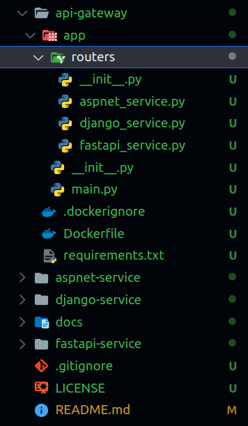
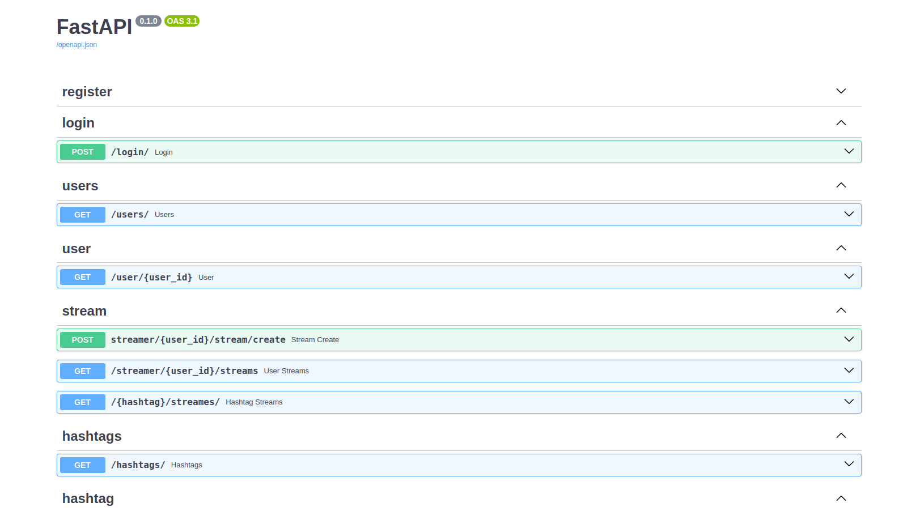
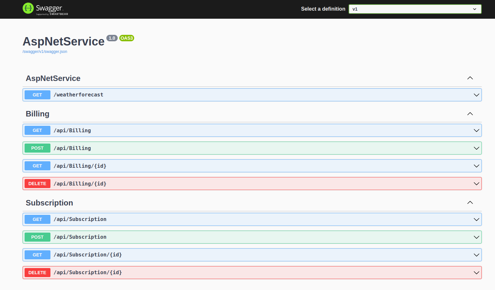

# Kh_Micro_Stream

Kh_Micro_Stream is an innovative project that unites ASP.NET Core, Django, and FastAPI, offering a comprehensive framework for developing microservices-based applications.

## Introduction

This project is a testament to the seamless integration of ASP.NET Core, Django, and FastAPI within a microservices architecture. It provides a robust foundation for constructing scalable and modular applications, capitalizing on the unique strengths of each framework.

## Project Structure

- **AspNetService:** ASP.NET Core microservice.
- **DjangoService:** Django microservice.
- **FastAPIService:** FastAPI microservice.



## Getting Started

To kickstart your journey with Kh_Micro_Stream, follow these straightforward steps:

### 1. Clone the Repository

```bash
git clone https://github.com/khfix/Kh-Micro-Stream.git
cd Kh_Micro_Stream
```

### Run The Project 
a- api-gateway:
```bash
cd api-gateway
docker build -t api-gateway .
docker run -p 80:80 api-gateway
```
The API Gateway documentation is available at http://0.0.0.0/docs.




b- aspnet-service:
```bash
cd aspnet-service
docker build -t aspnet-service .
docker run -d -p 8081:5232 aspnet-service
```
Explore the Asp.net Core documentation at http://localhost:5232/index.html.



c- django-service:
```bash
cd django-service
python -m venv django-service
source django-service/bin/activate
pip install -r requirements.txt
python manage.py makemigrations
python manage.py migrate
python manage.py createsuperuser
python manage.py runserver
```
Visit http://127.0.0.1:8000/admin/ to access the API Admin.


d- fastapi-service:
```bash
cd fastapi-service
python -m venv fastapi-service
source fastapi-service/bin/activate
pip install -r requirements.txt
cd app
uvicorn main:app --host 127.0.0.1 --port 8001
```
Explore the FastAPI Service at http://127.0.0.1:8001/docs#/.


## Development

During development, you can run each microservice independently. Refer to the README files in each service directory for specific instructions.


## Docker Support

Kh_Micro_Stream fully supports Docker for containerization. You can build and run the entire project using Docker. Check the Docker section in each microservice's README for detailed instructions.


## Contributing

Your contributions are invaluable to this project. Feel free to fork the repository, make your enhancements, and submit a pull request. Issues and feature requests are also highly encouraged.

## License

This project is licensed under the MIT License.